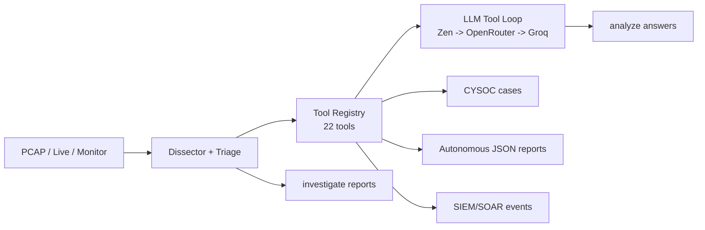

# EasyShark v2.0.0 (Autonomous Edition)

<p align="center" style="color: #00d4ff; font-weight: bold; line-height: 1.05;">
<pre style="color: #00d4ff; font-weight: bold;">
                    ███████  █████  ███████ ██   ██  █████  ██████  ██   ██
                                                                   v2.0.0


⠀⠀⠀⠀⠀⠀⠀⠀⠀⠀⠀⠀⠀⠀⠀⠀⠀⠀⠀⠀⠀⠀⠀⠀⠀⠀⠀⠀⠀⠀⠀⠀⠀⠀⠀⠀⠀⠀⠀⠀⠀⠀⠀⠲⣶⣶⣤⣤⣀⡀⠀⠀⠀⠀⠀⠀⠀⠀⠀⠀
⠀⠀⠀⠀⠀⠀⠀⠀⠀⠀⠀⠀⠀⠀⠀⠀⠀⠀⠀⠀⠀⠀⠀⠀⠀⠀⠀⠀⠀⠀⠀⠀⠀⠀⠀⠀⠀⠀⠀⠀⠀⠀⠀⠀⠀⠉⠛⠛⢻⣿⣷⣦⣀⠀⠀⠀⠀⠀⠀⠀
⠀⠀⠀⠀⠀⠀⠀⠀⠀⠀⠀⠀⠀⠀⠀⠀⠀⠀⠀⠀⠀⠀⠀⠀⠀⠀⠀⠀⠀⠀⠀⠀⠀⠀⠀⠀⠀⠀⠀⠀⠀⠀⠀⠀⠀⠀⠀⠀⠙⢿⣿⣿⣿⣧⡄⠀⠀⠀⠀⠀
⠀⠀⠀⠀⠀⠀⠀⠀⠀⠀⠀⠀⠀⠀⠀⠀⠀⠀⠀⠀⠀⠀⠀⠀⠀⠀⠀⠀⠀⠀⠀⠀⠀⠀⠀⠀⠀⠀⠀⠀⠀⠀⠀⠀⠀⠀⠀⠀⠀⠀⠈⢻⣿⣿⣿⡆⠀⠀⠀⠀
⠀⠀⠀⠀⠀⠀⠀⠀⠀⠀⠀⠀⠀⠀⠀⠀⠀⠀⠀⠀⠀⠀⠀⠀⠀⠀⠀⠀⠀⠀⠀⠀⠀⠀⠀⠀⠀⠀⠀⠀⠀⠀⠀⠀⠀⠀⠀⠀⠀⠀⠀⠀⢻⣿⣿⣿⡄⠀⠀⠀
⠀⠀⠀⠀⠀⠀⠀⠀⠀⠀⠀⠀⠀⠀⠀⠀⠀⠀⠀⠀⠀⠀⠀⠀⠀⠀⠀⠀⠀⠀⠀⠀⠀⠀⠀⠀⠀⠀⠀⠀⠀⠀⠀⠀⠀⠀⠀⠀⠀⠀⠀⢀⣾⣿⣿⣿⣿⣦⡀⠀
⠀⠀⠀⠀⠀⠀⠀⠀⠀⠀⠀⠀⠀⠀⠀⠀⠀⠀⠀⠀⠀⠀⠀⠀⠀⠀⠀⠀⠀⠀⠀⠀⠀⠀⠀⠀⠀⠀⠀⠀⠀⠀⠀⠀⠀⠀⠀⠀⠀⠀⣴⣿⣿⣿⡿⠿⢿⣿⣷⡀
⠀⠀⠀⠀⠀⠀⠀⠀⠀⠀⠀⠀⠀⠀⠀⠀⠀⠀⠀⠀⠀⠀⠀⠀⠀⠀⠀⠀⠀⠀⠀⠀⠀⣠⣴⣶⡆⠀⠀⠀⠀⠀⠀⠀⠀⠀⠀⠀⢠⣾⡿⠿⠛⠉⠀⠀⠀⣻⣿⡇
⠀⠀⠀⠀⠀⠀⠀⠀⠀⠀⠀⠀⠀⠀⠀⠀⠀⠀⠀⠀⠀⠀⠀⠀⠀⠀⠀⠀⠀⠀⠀⣠⣾⣿⣿⣿⡿⠀⠀⠀⠀⠀⠀⠀⠀⠀⠀⠀⠀⠀⠀⠀⠀⠀⠀⠀⠀⣰⣿⣿⡇
⠀⠀⠀⠀⠀⠀⠀⠀⠀⠀⠀⠀⠀⠀⠀⠀⠀⠀⠀⠀⠀⠀⠀⠀⠀⠀⠀⠀⠀⢀⣾⣿⣿⣿⣿⣿⡇⠀⠀⠀⠀⠀⠀⠀⠀⠀⠀⠀⠀⠀⠀⠀⠀⢀⣠⣾⣿⣿⣿⠇
⠀⠀⠀⠀⠀⠀⠀⠀⠀⠀⠀⠀⠀⠀⠀⠀⠀⠀⠀⠀⠀⠀⠀⠀⠀⠀⠀⠀⣴⣿⣿⣿⣿⣿⣿⣿⡀⠀⠀⠀⠀⠀⠀⠀⠀⠀⠀⠀⢀⣴⣶⣶⣶⣿⣿⣿⣿⣿⠏⠀
⠀⠀⠀⠀⠀⠀⠀⠀⠀⠀⠀⠀⠀⠀⠀⠀⠀⠀⠀⠀⠀⠀⠀⠀⢀⣀⣀⣾⣿⣿⣿⣿⣿⣿⣿⣿⣿⣶⣦⣤⣤⣤⣤⣶⣶⣶⣶⣶⣿⣿⣿⣿⣿⣿⣿⣿⣿⣿⠏⠀⠀
⠀⠀⠀⢀⣀⣀⣀⣀⣀⣤⣤⣴⣶⣶⣶⣶⣶⣿⣿⣿⣿⣿⣿⣿⣿⣿⣿⣿⣿⣿⣿⣿⣿⣿⣿⣿⣿⣿⣿⣿⣿⣿⣿⣿⣿⣿⣿⣿⣿⣿⣿⣿⣿⣿⠿⠛⠋⠀⠀⠀
⠲⣿⣿⣿⣿⣿⣿⣿⣿⣿⣿⣿⣿⣿⣿⣿⣿⣿⣿⣿⣿⣿⣿⣿⣿⣿⣿⣿⣿⣿⣿⣿⣿⣿⣿⣿⣿⣿⣿⣿⣿⣿⣿⣿⣿⣿⣿⣿⣿⣿⣿⣿⠛⠁⠀⠀⠀⠀⠀⠀
⠀⠀⠉⠛⠿⣿⣿⣿⣿⣿⣏⣨⣿⣿⣿⣿⣿⣿⣿⣿⣿⣿⣿⣿⣿⣿⣿⣿⣿⣿⣿⣿⣿⣿⣿⣿⣿⣿⣿⣿⣿⣿⣿⣿⣿⣿⣿⣿⣿⣿⡿⠁⠀⠀⠀⠀⠀⠀⠀⠀
⠀⠀⠀⠀⠀⠈⠋⢉⣉⣿⣿⣿⣿⣿⣿⣿⣿⣿⣿⣿⣿⣿⣿⣿⣿⣿⣿⣿⣿⣿⣿⣿⣿⣿⣿⣿⣿⣿⣿⣿⣿⣿⣿⠿⠛⠛⠉⠉⠉⠁⠀⠀⠀⠀⠀⠀⠀⠀⠀
⠀⠀⠀⠀⠀⠀⠘⠛⠿⠿⠿⢿⣿⣿⣿⣿⣿⣿⣿⣿⣿⣿⣿⣿⣿⣿⣿⣿⣿⣿⣿⣿⣿⣿⣿⣿⣿⠿⠿⠛⠋⠁⠀⠀⠀⠀⠀⠀⠀⠀⠀⠀⠀⠀⠀⠀⠀⠀⠀
⠀⠀⠀⠀⠀⠀⠀⠀⠀⠀⠀⠀⠈⠉⠙⠛⠿⠿⠿⣿⣿⣿⣿⣿⣿⣿⣿⣿⣿⣿⣿⣿⣿⡏⠉⠉⠀⠀⠀⠀⠀⠀⠀⠀⠀⠀⠀⠀⠀⠀⠀⠀⠀⠀⠀⠀⠀⠀⠀
⠀⠀⠀⠀⠀⠀⠀⠀⠀⠀⠀⠀⠀⠀⠀⠀⠀⠀⠀⣿⣿⣿⣿⣿⣿⠟⠻⣿⣿⣿⣿⣿⣿⣄⠀⠀⠀⠀⠀⠀⠀⠀⠀⠀⠀⠀⠀⠀⠀⠀⠀⠀⠀⠀⠀⠀⠀⠀
⠀⠀⠀⠀⠀⠀⠀⠀⠀⠀⠀⠀⠀⠀⠀⠀⠀⠀⠀⢻⣿⣿⣿⣿⠋⠀⠀⠀⠙⠿⣿⣿⣿⣿⣷⣄⠀⠀⠀⠀⠀⠀⠀⠀⠀⠀⠀⠀⠀⠀⠀⠀⠀⠀⠀⠀⠀⠀
⠀⠀⠀⠀⠀⠀⠀⠀⠀⠀⠀⠀⠀⠀⠀⠀⠀⠀⠀⢸⣿⣿⣿⠃⠀⠀⠀⠀⠀⠀⠀⠉⠛⠿⢿⣿⣷⡄⠀⠀⠀⠀⠀⠀⠀⠀⠀⠀⠀⠀⠀⠀⠀⠀⠀⠀⠀⠀
⠀⠀⠀⠀⠀⠀⠀⠀⠀⠀⠀⠀⠀⠀⠀⠀⠀⠀⠀⠈⣿⣿⠏⠀⠀⠀⠀⠀⠀⠀⠀⠀⠀⠀⠀⠀⠀⠀⠀⠀⠀⠀⠀⠀⠀⠀⠀⠀⠀⠀⠀⠀⠀⠀⠀⠀⠀⠀
⠀⠀⠀⠀⠀⠀⠀⠀⠀⠀⠀⠀⠀⠀⠀⠀⠀⠀⠀⠀⠻⠏⠀⠀⠀⠀⠀⠀⠀⠀⠀⠀⠀⠀⠀⠀⠀⠀⠀⠀⠀⠀⠀⠀⠀⠀⠀⠀⠀⠀⠀⠀⠀⠀⠀⠀⠀⠀
</pre>
</p>
<p align="center">
  <a href="https://opensource.org/licenses/MIT"></a>
  <a href=""></a>
  <a href=""></a>
  <a href=""></a>
</p>

Sagnik Ray · Suraj Mishra · Md Sahil Molla

---

EasyShark is a terminal-native PCAP forensic analyst that answers
investigation questions in plain English.

---

## The Problem

Wireshark is the best traditional tool for network analysis and essential for
learning networking fundamentals. But when the workload gets heavier — triaging
multiple captures under time pressure, hunting for specific IOCs across
thousands of packets, or correlating events across protocols — navigating
through filters, streams, and menus turns into a nightmare. EasyShark is built
for exactly those scenarios.

---

## Demo

```
pcap > analyze What SMTP credentials were used?
pcap > analyze What is the MD5 of the AIM file transfer?
pcap > investigate Who exfiltrated data? --auto
pcap > protocols
pcap > creds
pcap > extract-media /tmp/extracted
pcap > soc-analyst terminal
```

---

## How It Works

### Simple view



### Compared to Wireshark

| Traditional Wireshark Workflow | EasyShark Workflow |
|---|---|
| Know which filter to type | Type the question in natural language |
| Manually follow TCP streams | `analyze What SMTP credentials were used?` |
| Cross-reference IPs/domains manually | Tools return structured evidence automatically |
| Build a timeline by inspecting packets | `investigate` generates hypotheses and verifies them |
| No LLM integration | Deterministic dissector + cloud LLM for reasoning |

<details>
<summary>Full architecture diagram</summary>


</details>

---

## Installation

### Prerequisites

- Python 3.10+
- WSL2 / Linux / macOS (recommended)
- 7.4 GB RAM minimum
- API key: Zen (primary) or OpenRouter / Groq (fallback)
- No GPU required. No local model required.

### Install

```bash
pip install -r requirements.txt
cp .env.example .env
# Add your Zen API key to .env
```

### Run

```bash
python3 main.py PCAP_SAMPLES/evidence01.pcap
```

---

## Sample Captures

The repository ships with labelled and unlabelled captures:

| File | Description | Size |
|---|---|---|
| `evidence01.pcap` | AIM file transfer (240 packets) | Labelled |
| `evidence02.pcap` | SMTP email with docx attachment (572 packets) | Labelled |
| `evidence03.pcap` | HTTP / AppleTV traffic (1778 packets) | Unlabelled |
| `evidence04.pcap` | Mixed traffic (short) | Unlabelled |
| `infected.pcap` | Unknown - potentially malicious | Unlabelled |

**Try on evidence01:**
```
pcap > analyze What is the MD5 of the file transferred over AIM?
pcap > analyze How many TCP packets were sent to port 443 by 192.168.1.158?
pcap > investigate What happened in this capture? --auto
```

**Try on evidence02:**
```
pcap > analyze What SMTP credentials were used?
pcap > analyze extract the embedded image from the docx and save it to /tmp/
pcap > extract-media /tmp/extracted
```

---

## Features

### Core Features

**Natural-language Q&A (`analyze`).** Ask questions in plain English. The LLM
calls the right forensic tool, cites evidence, and returns a sourced answer
with claim grounding and hallucination detection. A deterministic
premise-mismatch gate refuses questions about protocols the capture does not
contain.

```
pcap > analyze What SMTP credentials were used?
pcap > analyze What is the MD5 of the AIM file transfer?
pcap > analyze compute the standard deviation of UDP packet sizes
```

**Multi-hypothesis investigation (`investigate`).** Generates ranked
hypotheses, verifies each via the tool loop (planner -> executor -> critic),
and concludes with a structured incident report. Supports `--auto` for
non-interactive runs.

```
pcap > investigate What happened in this capture?
pcap > investigate Who exfiltrated data? --auto
```

**Autonomous headless mode (`--autonomous`).** Runs the full pipeline without
an interactive shell. The PCAP directory monitor (`--monitor`) watches a
directory and runs the autonomous pipeline on each new capture. Jobs are
persisted in `jobs.db` and retried up to three times.

```bash
python3 main.py capture.pcap --autonomous --mission "Investigate exfiltration"
python3 main.py --monitor ./captures --interval 30 --mission "Triage all captures"
```

**Sandboxed Python execution.** LLM-generated code runs in an isolated sandbox:
in-process (restricted builtins, banlist, 5s timeout) or Docker container via
OpenSandbox (deny-by-default egress, CPU/memory limits, destroyed after each
run). The payload is written to a file inside the container to avoid argv
length limits. Also enables `create_tool` — the LLM can define new sandboxed
tools at runtime when no existing tool fits the question.

```
EASYSHARK_SANDBOX_BACKEND=auto   # try container, fall back to in-process
EASYSHARK_SANDBOX_BACKEND=opensandbox  # require Docker container
EASYSHARK_SANDBOX_BACKEND=local  # in-process only
```

**22 deterministic forensic tools.** Read-only tools gated by triage flags,
exposed to the LLM during analysis:

| Tool | What it does |
|---|---|
| `get_statistics` | Packet/flow/alert counts, top protocols, IPs, ports |
| `search_payloads` | Regex search over TCP/UDP payload bytes |
| `extract_files` | Carve files by magic-byte detection |
| `follow_stream` | Reassembled ASCII stream for a flow |
| `get_smtp_credentials` | Decoded SMTP AUTH LOGIN / PLAIN exchanges |
| `get_email_attachments` | MIME attachment metadata + embedded media MD5s |
| `compute_packets` | Structured aggregation (count, sum, avg, min, max) |
| `extract_embedded_media` | Save embedded docx images to a host path |

**12-protocol deep dissector.** HTTP, SMTP, FTP, DNS, TLS, DHCP, ARP, ICMP,
SSH, IRC, SMB, NBNS, IMAP, POP3 extracted at load time.

**8 deterministic info commands.** `protocols`, `ips`, `flows`, `files`,
`dns`, `creds`, `summary`, `extract-media` — all work fully offline.

**8 anomaly detectors.** Beaconing, DNS entropy/tunnelling, exfiltration ratio,
horizontal/vertical port scan, protocol-port mismatch, lateral movement, long
connections, domain reputation signals, TLS fingerprint anomalies, and
prompt-injection payload detection. All deterministic, no LLM required.

**TLS fingerprinting.** JA3/JA4-style ClientHello metadata analysis.

**Packet anonymizer.** `core.anonymizer.Anonymizer` creates safe packet
metadata for external model calls without modifying the original capture.

**Prompt-injection defense.** Packet/tool content is wrapped in untrusted
observation envelopes. Instruction-like payloads are detected as security
findings and blocked from the response path. Red-team fixtures validate 10/10
malicious payload detection with 0/3 false positives.

**Session persistence + memory.** Sessions saved automatically, resumable via
`--session <key>` or `--session latest`. Action log via `events` command.
LLM tool-call memory via `memory` command.

---

### Optional Features (Under Testing)

These features are functional and tested but are considered additive to the
core workflow. They may see API changes as development continues.

#### Incident Reports

`report` runs detectors -> narrative compression -> single LLM synthesis call,
producing an incident narrative, suspect hosts, MITRE ATT&CK techniques, IOCs,
and next steps. A confidence gate skips the LLM call when anomaly scores are
too low. Exports include `--mitre`, `--sigma`, and `--spl`.

#### CYSOC SOC Workspace

A dedicated SOC terminal with alert queue, case management, entity hunting,
multi-sensor fusion, behavioral baselines, oracle benchmarking,
approval-gated response, and threat intel feeds.

```
pcap > cysoc-terminal
cysoc > overview
cysoc > queue p1,p2
cysoc > case create P1 Suspected C2 beacon
cysoc > hunt 192.168.1.159
cysoc > correlate FIN-LAPTOP-22
cysoc > baseline check FIN-LAPTOP-22 bytes_out 5000000
cysoc > action request CYSOC-20260812-AB12 Isolate FIN-LAPTOP-22
cysoc > benchmark corpus PCAP_SAMPLES/generated/manifest.json
cysoc > oracle
```

See [`README-CYSOC.md`](README-CYSOC.md) for the complete command reference.

#### Threat Intelligence

- **Feodo Tracker + URLhaus + ThreatFox.** ~24,568 indicators auto-downloaded
  and cached locally.
- **IOC auto-annotation.** Badges in reports and investigations: `KNOWN
  MALICIOUS`, `CLEAN`, `UNKNOWN`.

#### RSI Pattern Learning

Tool and prompt patterns are promoted only from independent oracle outcomes.
Requires 3 labels at >= 0.75 for activation, retired below 0.40.

#### Synthetic PCAP Corpus + Oracle

7 deterministically generated captures (beaconing, DNS tunnel, exfiltration,
port scan, prompt injection, benign control) with hash-pinned manifest for
regression testing. Oracle scoring reports precision, recall, Brier score,
and ECE.

#### Deployment Tooling

- **SIEM/SOAR integration.** `--event-log` writes versioned JSONL envelopes for
  ingestion. `--event-webhook` sends the same envelopes over HTTPS with retry
  and persistence.
- **Health endpoint.** `/health` and `/metrics` on the monitor port. Run with
  `--health-port 8765` and `EASYSHARK_HEALTH_TOKEN` for auth.
- **Docker + docker-compose.** Monorepo includes `Dockerfile` and
  `docker-compose.yml`.
- **Observability counters.** `core.observability` exposes counters; audit
  logging via `core.audit`.

---

## Commands

| Command | Description |
|---|---|
| `analyze <question>` | Ask a forensic question (LLM-powered) |
| `investigate <q>` | Multi-hypothesis investigation |
| `report [--json] [--mitre] [--force]` | Full incident report (detectors + LLM) |
| `anomalies` | Ranked anomaly list (no LLM, <1s) |
| `timeline` | Compressed behavioral timeline |
| `protocols` | Protocol breakdown table |
| `ips` | Host summary table |
| `flows` | Top flows table |
| `files` | Extracted files list |
| `dns` | DNS queries and anomalies |
| `creds` | Extracted credentials |
| `summary` | Capture overview (0 LLM calls) |
| `extract <filename>` | Save extracted file to disk |
| `extract-media <dir>` | Save embedded docx images to disk |
| `filter <expression>` | Wireshark display filter |
| `search <regex>` | Regex search over payloads |
| `dissect <idx>` | Detailed packet breakdown |
| `hex <idx>` | Hex dump of a packet |
| `follow tcp\|udp <id>` | Reassembled stream view |
| `capture interfaces` | List capture interfaces |
| `capture start <if>` | Start live capture |
| `capture stop` | Stop and reload capture |
| `sessions` | List saved sessions |
| `session info` | Current session details |
| `session forget` | Delete current session |
| `update-feeds` | Download threat intel feeds |
| `ioc-check <value>` | Check an IOC against local feeds |
| `feeds` | Show feed status |
| `events [limit]` | Activity log |
| `reports` | List saved investigation reports |
| `evidence <idx>` | Evidence graph for a report |
| `memory rsi status` | Pattern learner status |
| `soc-analyst [mission]` | Autonomous SOC triage |
| `cysoc-terminal` | Open CYSOC workspace |
| `help` | Show help |
| `exit / quit` | Exit EasyShark |

---

## Configuration

### LLM Providers

| Env var | Purpose | Default |
|---|---|---|
| `ZEN_API_KEY` | Primary cloud provider (Zen) | - |
| `ZEN_EXPLAINER_MODEL` | Model for forensic Q&A | `deepseek-v4-flash` |
| `ZEN_PLANNER_MODEL` | Model for intent routing | `gpt-5-nano` |
| `ZEN_CODER_MODEL` | Model for code generation | `gpt-5.4-nano` |
| `OPENROUTER_API_KEY` | Secondary fallback | - |
| `GROQ_API_KEY` | Last-resort fallback | - |

### Sandbox

| Env var | Purpose | Default |
|---|---|---|
| `EASYSHARK_SANDBOX_BACKEND` | `local` / `opensandbox` / `auto` | `auto` |
| `EASYSHARK_PROCESS_SANDBOX` | Route python_eval through subprocess | `0` |
| `EASYSHARK_ALLOW_PYTHON_EVAL` | Advertise python_eval to the LLM | `0` |
| `OPEN_SANDBOX_DOMAIN` | OpenSandbox server address | `localhost:8080` |
| `OPEN_SANDBOX_PROTOCOL` | `http` or `https` | `http` |

### Deployment

| Env var | Purpose | Default |
|---|---|---|
| `EASYSHARK_HEALTH_TOKEN` | Auth for /health endpoint | - |
| `EASYSHARK_ALLOW_HTTP_WEBHOOK` | Allow non-HTTPS webhooks | `0` |
| `EASYSHARK_THREAT_FEED` | Path to local threat intel JSON | - |
| `EASYSHARK_SOC_DB` | CYSOC SQLite database path | `~/.easyshark/cysoc.db` |
| `EASYSHARK_REPORTS_DIR` | Report output directory | `~/.easyshark/reports/` |
| `EASYSHARK_ASSET_POLICY` | Asset criticality JSON file | - |
| `EASYSHARK_CONNECTOR_HOSTS` | Allow-listed HTTPS connector hosts | - |

---

## Deployment

### Interactive shell

```bash
python3 main.py capture.pcap
```

### Autonomous headless

```bash
python3 main.py capture.pcap --autonomous \
  --mission "Investigate suspicious activity and possible data exfiltration" \
  --threat-feed ./intel.json
```

### Autonomous SOC triage

```bash
python3 main.py capture.pcap --autonomous --mode soc-analyst \
  --mission "Triage, scope, and document suspicious activity"
```

### Continuous monitor + webhook

```bash
python3 main.py --monitor ./captures --interval 30 \
  --mission "Investigate suspicious activity and possible exfiltration" \
  --webhook https://siem.example/events
```

### Docker

```bash
docker build -t easyshark .
docker run --rm -v "$PWD/captures:/captures" -v easyshark-data:/data \
  -p 127.0.0.1:8765:8765 easyshark \
  --monitor /captures --health-port 8765
```

### docker-compose

```bash
cp .env.example .env
docker compose up --build
```

---

## Limitations

EasyShark is in active development. Known limitations:

- **Hallucinated answers** — the LLM can invent evidence. The claim-grounding
  pass and hallucination detector flag these, but they are not foolproof.
- **Cloud dependency for LLM** — `analyze`, `investigate`, and `report` require
  a reachable cloud provider (Zen / OpenRouter / Groq). Deterministic commands
  (`anomalies`, `timeline`, `protocols`, `ips`, `creds`, `summary`,
  `extract-media`) work fully offline.
- **Rate limits** — free-tier cloud models can timeout or return 429s. The
  3-provider fallback chain mitigates this but does not eliminate it.
- **No TLS decryption** — TLS ClientHello metadata and JA3/JA4 fingerprints
  are analysed, but application content inside TLS is not decrypted.
- **Sandbox is compute-only** — the OpenSandbox container has no host-filesystem
  bridge. Files written inside the container are destroyed after each run.
  Host-side tools (`extract-media`) handle persistence.
- **Not production-validated** — 126 automated tests pass, but production
  readiness requires 500+ independently labelled captures, held-out ECE below
  0.10, and prompt-injection red-team corpus testing.
- **No external response execution** — approving a containment action records
  authorisation only. No automatically enabled production containment connector
  ships with EasyShark.
- **Single-capture analysis** — EasyShark analyses one PCAP at a time.
  Multi-capture correlation is via the CYSOC case timeline, not cross-capture
  packet analysis.

---

## Roadmap

- **Fully local mode** — air-gapped operation with no API keys required.
- **Expanded protocol dissection** — additional layer-7 protocol parsers.
- **Multi-capture correlation** — cross-PCAP analysis for campaign-level
  investigation.
- **Production-validated oracle** — 500+ independently labelled captures for
  held-out calibration.
- **CYSOC connector** — automated containment response through a separately
  authenticated connector.

---

## Contributing

### What we need

- **New forensic tools** — add tools to `ai/tool_registry.py`
- **Dissector extractors** — add protocol parsers to `core/dissector.py`
- **Detectors** — add anomaly detectors to `core/detectors.py`
- **Pattern learner** — improve learned tool hint accuracy in
  `ai/pattern_learner.py`
- **Prompt optimisation** — sharpen system prompts in `config/settings.py`
- **Test coverage** — add regression tests for new PCAPs in `tests/`
- **CYSOC commands** — extend the SOC workspace in `cli/cysoc_commands.py`
- **Oracle sources** — add independent evaluation sources in `ai/oracle.py`

### Getting started

```bash
git clone https://github.com/cybersagnik/Easyshark
cd Easyshark
git checkout autonomous
pip install -r requirements.txt
python3 -m unittest discover tests
```

### Style guide

- No comments unless explicitly requested.
- No emojis in code or output unless requested.
- ANSI escape codes only. No third-party TUI libraries (no curses, no rich).
- TUI rendering is frozen — ANSI-aware box/table code in `cli/` must not
  regress.

### Good first issues

- Add a new forensic tool to `ai/tool_registry.py`
- Add a protocol parser to `core/dissector.py`
- Add a regression test for a new PCAP

---

## License

MIT — see [LICENSE](LICENSE). Free to use, modify, and distribute.

Built by Sagnik Ray, Suraj Mishra, and Md Sahil Molla.
