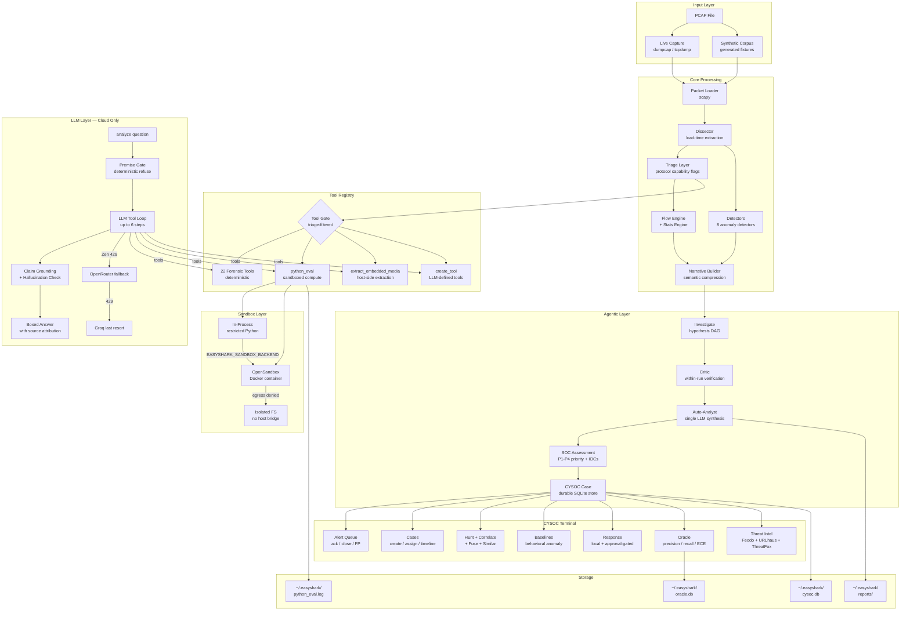

# EasyShark v2.0.0 (Autonomous Edition)

<p align="center" style="color: #00d4ff; font-weight: bold; line-height: 1.05;">
<pre style="color: #00d4ff; font-weight: bold;">
                    ███████  █████  ███████ ██   ██  █████  ██████  ██   ██
                                                                   v2.0.0


⠀⠀⠀⠀⠀⠀⠀⠀⠀⠀⠀⠀⠀⠀⠀⠀⠀⠀⠀⠀⠀⠀⠀⠀⠀⠀⠀⠀⠀⠀⠀⠀⠀⠀⠀⠀⠀⠀⠀⠀⠀⠀⠀⠲⣶⣶⣤⣤⣀⡀⠀⠀⠀⠀⠀⠀⠀⠀⠀⠀
⠀⠀⠀⠀⠀⠀⠀⠀⠀⠀⠀⠀⠀⠀⠀⠀⠀⠀⠀⠀⠀⠀⠀⠀⠀⠀⠀⠀⠀⠀⠀⠀⠀⠀⠀⠀⠀⠀⠀⠀⠀⠀⠀⠀⠀⠉⠛⠛⢻⣿⣷⣦⣀⠀⠀⠀⠀⠀⠀⠀
⠀⠀⠀⠀⠀⠀⠀⠀⠀⠀⠀⠀⠀⠀⠀⠀⠀⠀⠀⠀⠀⠀⠀⠀⠀⠀⠀⠀⠀⠀⠀⠀⠀⠀⠀⠀⠀⠀⠀⠀⠀⠀⠀⠀⠀⠀⠀⠀⠙⢿⣿⣿⣿⣧⡄⠀⠀⠀⠀⠀
⠀⠀⠀⠀⠀⠀⠀⠀⠀⠀⠀⠀⠀⠀⠀⠀⠀⠀⠀⠀⠀⠀⠀⠀⠀⠀⠀⠀⠀⠀⠀⠀⠀⠀⠀⠀⠀⠀⠀⠀⠀⠀⠀⠀⠀⠀⠀⠀⠀⠀⠈⢻⣿⣿⣿⡆⠀⠀⠀⠀
⠀⠀⠀⠀⠀⠀⠀⠀⠀⠀⠀⠀⠀⠀⠀⠀⠀⠀⠀⠀⠀⠀⠀⠀⠀⠀⠀⠀⠀⠀⠀⠀⠀⠀⠀⠀⠀⠀⠀⠀⠀⠀⠀⠀⠀⠀⠀⠀⠀⠀⠀⠀⢻⣿⣿⣿⡄⠀⠀⠀
⠀⠀⠀⠀⠀⠀⠀⠀⠀⠀⠀⠀⠀⠀⠀⠀⠀⠀⠀⠀⠀⠀⠀⠀⠀⠀⠀⠀⠀⠀⠀⠀⠀⠀⠀⠀⠀⠀⠀⠀⠀⠀⠀⠀⠀⠀⠀⠀⠀⠀⠀⢀⣾⣿⣿⣿⣿⣦⡀⠀
⠀⠀⠀⠀⠀⠀⠀⠀⠀⠀⠀⠀⠀⠀⠀⠀⠀⠀⠀⠀⠀⠀⠀⠀⠀⠀⠀⠀⠀⠀⠀⠀⠀⠀⠀⠀⠀⠀⠀⠀⠀⠀⠀⠀⠀⠀⠀⠀⠀⠀⣴⣿⣿⣿⡿⠿⢿⣿⣷⡀
⠀⠀⠀⠀⠀⠀⠀⠀⠀⠀⠀⠀⠀⠀⠀⠀⠀⠀⠀⠀⠀⠀⠀⠀⠀⠀⠀⠀⠀⠀⠀⠀⠀⣠⣴⣶⡆⠀⠀⠀⠀⠀⠀⠀⠀⠀⠀⠀⢠⣾⡿⠿⠛⠉⠀⠀⠀⣻⣿⡇
⠀⠀⠀⠀⠀⠀⠀⠀⠀⠀⠀⠀⠀⠀⠀⠀⠀⠀⠀⠀⠀⠀⠀⠀⠀⠀⠀⠀⠀⠀⠀⣠⣾⣿⣿⣿⡿⠀⠀⠀⠀⠀⠀⠀⠀⠀⠀⠀⠀⠀⠀⠀⠀⠀⠀⠀⠀⣰⣿⣿⡇
⠀⠀⠀⠀⠀⠀⠀⠀⠀⠀⠀⠀⠀⠀⠀⠀⠀⠀⠀⠀⠀⠀⠀⠀⠀⠀⠀⠀⠀⢀⣾⣿⣿⣿⣿⣿⡇⠀⠀⠀⠀⠀⠀⠀⠀⠀⠀⠀⠀⠀⠀⠀⠀⢀⣠⣾⣿⣿⣿⠇
⠀⠀⠀⠀⠀⠀⠀⠀⠀⠀⠀⠀⠀⠀⠀⠀⠀⠀⠀⠀⠀⠀⠀⠀⠀⠀⠀⠀⣴⣿⣿⣿⣿⣿⣿⣿⡀⠀⠀⠀⠀⠀⠀⠀⠀⠀⠀⠀⢀⣴⣶⣶⣶⣿⣿⣿⣿⣿⠏⠀
⠀⠀⠀⠀⠀⠀⠀⠀⠀⠀⠀⠀⠀⠀⠀⠀⠀⠀⠀⠀⠀⠀⠀⠀⢀⣀⣀⣾⣿⣿⣿⣿⣿⣿⣿⣿⣿⣶⣦⣤⣤⣤⣤⣶⣶⣶⣶⣶⣿⣿⣿⣿⣿⣿⣿⣿⣿⣿⠏⠀⠀
⠀⠀⠀⢀⣀⣀⣀⣀⣀⣤⣤⣴⣶⣶⣶⣶⣶⣿⣿⣿⣿⣿⣿⣿⣿⣿⣿⣿⣿⣿⣿⣿⣿⣿⣿⣿⣿⣿⣿⣿⣿⣿⣿⣿⣿⣿⣿⣿⣿⣿⣿⣿⣿⣿⠿⠛⠋⠀⠀⠀
⠲⣿⣿⣿⣿⣿⣿⣿⣿⣿⣿⣿⣿⣿⣿⣿⣿⣿⣿⣿⣿⣿⣿⣿⣿⣿⣿⣿⣿⣿⣿⣿⣿⣿⣿⣿⣿⣿⣿⣿⣿⣿⣿⣿⣿⣿⣿⣿⣿⣿⣿⣿⠛⠁⠀⠀⠀⠀⠀⠀
⠀⠀⠉⠛⠿⣿⣿⣿⣿⣿⣏⣨⣿⣿⣿⣿⣿⣿⣿⣿⣿⣿⣿⣿⣿⣿⣿⣿⣿⣿⣿⣿⣿⣿⣿⣿⣿⣿⣿⣿⣿⣿⣿⣿⣿⣿⣿⣿⣿⣿⡿⠁⠀⠀⠀⠀⠀⠀⠀⠀
⠀⠀⠀⠀⠀⠈⠋⢉⣉⣿⣿⣿⣿⣿⣿⣿⣿⣿⣿⣿⣿⣿⣿⣿⣿⣿⣿⣿⣿⣿⣿⣿⣿⣿⣿⣿⣿⣿⣿⣿⣿⣿⣿⠿⠛⠛⠉⠉⠉⠁⠀⠀⠀⠀⠀⠀⠀⠀⠀
⠀⠀⠀⠀⠀⠀⠘⠛⠿⠿⠿⢿⣿⣿⣿⣿⣿⣿⣿⣿⣿⣿⣿⣿⣿⣿⣿⣿⣿⣿⣿⣿⣿⣿⣿⣿⣿⠿⠿⠛⠋⠁⠀⠀⠀⠀⠀⠀⠀⠀⠀⠀⠀⠀⠀⠀⠀⠀⠀
⠀⠀⠀⠀⠀⠀⠀⠀⠀⠀⠀⠀⠈⠉⠙⠛⠿⠿⠿⣿⣿⣿⣿⣿⣿⣿⣿⣿⣿⣿⣿⣿⣿⡏⠉⠉⠀⠀⠀⠀⠀⠀⠀⠀⠀⠀⠀⠀⠀⠀⠀⠀⠀⠀⠀⠀⠀⠀⠀
⠀⠀⠀⠀⠀⠀⠀⠀⠀⠀⠀⠀⠀⠀⠀⠀⠀⠀⠀⣿⣿⣿⣿⣿⣿⠟⠻⣿⣿⣿⣿⣿⣿⣄⠀⠀⠀⠀⠀⠀⠀⠀⠀⠀⠀⠀⠀⠀⠀⠀⠀⠀⠀⠀⠀⠀⠀⠀
⠀⠀⠀⠀⠀⠀⠀⠀⠀⠀⠀⠀⠀⠀⠀⠀⠀⠀⠀⢻⣿⣿⣿⣿⠋⠀⠀⠀⠙⠿⣿⣿⣿⣿⣷⣄⠀⠀⠀⠀⠀⠀⠀⠀⠀⠀⠀⠀⠀⠀⠀⠀⠀⠀⠀⠀⠀⠀
⠀⠀⠀⠀⠀⠀⠀⠀⠀⠀⠀⠀⠀⠀⠀⠀⠀⠀⠀⢸⣿⣿⣿⠃⠀⠀⠀⠀⠀⠀⠀⠉⠛⠿⢿⣿⣷⡄⠀⠀⠀⠀⠀⠀⠀⠀⠀⠀⠀⠀⠀⠀⠀⠀⠀⠀⠀⠀
⠀⠀⠀⠀⠀⠀⠀⠀⠀⠀⠀⠀⠀⠀⠀⠀⠀⠀⠀⠈⣿⣿⠏⠀⠀⠀⠀⠀⠀⠀⠀⠀⠀⠀⠀⠀⠀⠀⠀⠀⠀⠀⠀⠀⠀⠀⠀⠀⠀⠀⠀⠀⠀⠀⠀⠀⠀⠀
⠀⠀⠀⠀⠀⠀⠀⠀⠀⠀⠀⠀⠀⠀⠀⠀⠀⠀⠀⠀⠻⠏⠀⠀⠀⠀⠀⠀⠀⠀⠀⠀⠀⠀⠀⠀⠀⠀⠀⠀⠀⠀⠀⠀⠀⠀⠀⠀⠀⠀⠀⠀⠀⠀⠀⠀⠀⠀
</pre>
</p>
<p align="center">
  <a href="https://opensource.org/licenses/MIT"></a>
  <a href=""></a>
  <a href=""></a>
  <a href=""></a>
</p>

**Authors:** Sagnik Ray, Suraj Mishra, Md Sahil Molla

---

Wireshark, for decades, has been the best traditional tool for network analysis. It is essential for learning networking fundamentals and conducting serious packet-level forensics. But when the workload gets heavier — triaging multiple captures under time pressure, hunting for specific Indicators of Compromise (IOCs) across thousands of packets, or correlating events across protocols — navigating through Wireshark's filters, streams, and menus can turn into a nightmare.

EasyShark is built for exactly those scenarios. It is a **terminal-native, natural-language-driven PCAP forensic analyst** that lets you ask investigation questions in plain English. EasyShark analyses the capture, calls the right forensic tool for the job, and hands you the answer — with source attribution.

---

## What Makes EasyShark Different

| Traditional Wireshark Workflow | EasyShark Workflow |
|---|---|
| Know which filter to type | Type the question in natural language |
| Manually follow TCP streams | `analyze What SMTP credentials were used?` |
| Cross-reference IPs/domains manually | Tools return structured evidence automatically |
| Build a timeline by inspecting packets | `investigate` generates hypotheses and verifies them |
| No LLM integration | Deterministic dissector + cloud LLM for reasoning |

No GUI. No local model daemon. Just packets and prompts.

---

## Architecture Overview



The shell exposes deterministic info commands (`protocols`, `ips`, `flows`, `files`, `dns`, `creds`, `summary`, `extract-media`) and AI-powered commands (`analyze`, `investigate`, `report`, `soc-analyst`). The LLM tool loop uses a 3-provider cloud fallback chain — Zen (primary) → OpenRouter (secondary) → Groq (last resort). No local model is required or supported.

---

## Commands

### Quick Start

```bash
# Install dependencies
pip install -r requirements.txt

# Set up API keys (copy and edit)
cp .env.example .env
# Edit .env with your Zen API key (or OpenRouter/Groq as fallback)

# Analyse a PCAP
python3 main.py PCAP_SAMPLES/evidence01.pcap
```

### Terminal Commands

```
┌─ Commands ──────────────────────────────────────────────────┐
│ analyze <question>   Ask a forensic question (LLM-powered)  │
│ investigate <q>      Multi-hypothesis investigation         │
│ report               Full incident report (detectors + LLM)  │
│ anomalies            Ranked anomaly list (no LLM, <1s)      │
│ timeline             Compressed behavioral timeline         │
│ protocols            Protocol breakdown table               │
│ ips                  Host summary table                     │
│ flows                Top flows table                        │
│ files                Extracted files list                   │
│ dns                  DNS queries and anomalies              │
│ creds                Extracted credentials                  │
│ summary              Capture overview (0 LLM calls)         │
│ extract <filename>   Save extracted file to disk            │
│ extract-media <dir>  Save embedded docx images to disk      │
│ capture interfaces   List capture interfaces                │
│ capture start <if>   Start live capture                     │
│ capture stop         Stop and reload capture                │
│ sessions             List saved sessions                    │
│ session info         Current session details                │
│ session forget       Delete current session                 │
│ soc-analyst [mission] Autonomous SOC triage                │
│ cysoc-terminal       Open CYSOC workspace                   │
│ exit / quit          Exit EasyShark                         │
└──────────────────────────────────────────────────────────────┘
```

### Autonomous Headless Investigation

```bash
python3 main.py PCAP_SAMPLES/evidence01.pcap --autonomous \
  --mission "Investigate suspicious activity and possible data exfiltration" \
  --threat-feed ./intel.json
```

### Autonomous SOC Triage

```bash
python3 main.py capture.pcap --autonomous --mode soc-analyst \
  --mission "Triage, scope, and document suspicious activity"
```

### CYSOC Terminal

```text
pcap > soc-analyst terminal

cysoc > overview
cysoc > triage Investigate possible command-and-control traffic
cysoc > pulse
cysoc > queue p1,p2
cysoc > case create P1 Suspected C2 beacon
cysoc > hunt 192.168.1.159
cysoc > correlate FIN-LAPTOP-22
cysoc > baseline check FIN-LAPTOP-22 bytes_out 5000000
cysoc > action request CYSOC-20260812-AB12 Isolate FIN-LAPTOP-22
cysoc > action approve 1 soc-lead
cysoc > benchmark corpus PCAP_SAMPLES/generated/manifest.json
cysoc > oracle
cysoc > back
```

`cysoc-terminal` is a direct alias. See [`README-CYSOC.md`](README-CYSOC.md) for the complete CYSOC guide.

### Monitoring and Deployment

```bash
# Continuous monitor
python3 main.py --monitor ./captures --interval 30 \
  --mission "Investigate suspicious activity and possible exfiltration" \
  --webhook https://example.invalid/security-events

# Docker
docker build -t easyshark .
docker run --rm -v "$PWD/captures:/captures" -v easyshark-data:/data \
  -p 127.0.0.1:8765:8765 easyshark \
  --monitor /captures --health-port 8765 --once
```

---

## Features

### Natural-Language Forensic Q&A
Ask questions in plain English. The LLM calls the right forensic tool, cites evidence, and returns a sourced answer. A deterministic premise-mismatch gate refuses questions about protocols the capture doesn't contain.

### 22 Deterministic Forensic Tools
Read-only tools including `get_statistics`, `search_payloads`, `extract_files`, `follow_stream`, `get_smtp_credentials`, `get_email_attachments`, `compute_packets`, `extract_embedded_media`, and more. All gated by triage flags so only relevant tools are advertised to the LLM.

### Sandboxed Code Execution
LLM-generated Python runs in an isolated sandbox — either in-process (restricted builtins, banlist, 5s timeout) or in a Docker container via OpenSandbox (deny-by-default egress, resource limits, destroyed after each run). The payload is written to a file inside the container to avoid argv length limits.

### 8 Anomaly Detectors
Beaconing, DNS entropy/tunneling, exfiltration ratio, port scan (horizontal + vertical), protocol-port mismatch, lateral movement, long connections, domain reputation, TLS fingerprint anomalies, and prompt-injection payload detection — all deterministic, no LLM required.

### Autonomous Investigation (Hypothesis DAG)
The `investigate` command generates hypotheses, verifies each via the tool loop, and concludes with a structured incident report. The `--autonomous` flag runs headless with planner → executor → critic DAG.

### CYSOC Terminal
A dedicated SOC workspace with alert queue, case management, entity hunting, multi-sensor fusion, behavioral baselines, oracle benchmarking, approval-gated response, and threat intel feeds — all terminal-native.

### Incident Reports with MITRE Mapping
The `report` command runs detectors → narrative compression → single LLM synthesis call, producing an incident narrative, suspect hosts, MITRE ATT&CK techniques, IOCs, and analyst next steps. A confidence gate skips the LLM call when anomaly scores are too low.

### Threat Intelligence Integration
Cross-reference detected IOCs against Feodo Tracker, URLhaus, and ThreatFox feeds (~24,568 indicators). IOCs are auto-annotated with badges (KNOWN MALICIOUS / CLEAN / UNKNOWN) in reports and investigations.

### Live Capture
Capture traffic via `dumpcap` or `tcpdump`. On stop, the capture is hot-reloaded into the shell and auto-reported. Graceful error handling when no capture tool is installed.

### Session Persistence and Memory
Sessions are saved automatically and resumable via `--session <key>`. The failure library logs heuristic misses for pattern growth. RSI patterns require 3 independent oracle labels before activation.

### Synthetic PCAP Corpus
7 deterministically generated PCAPs (beaconing, DNS tunnel, exfiltration, port scan, prompt injection, benign control) with hash-pinned manifests for regression testing. Oracle scoring reports precision, recall, Brier score, and ECE.

### Prompt-Injection Defense
Packet/tool content is wrapped in untrusted-observation envelopes. Instruction-like payloads are detected as security findings and blocked from the response path. Red-team fixtures validate 10/10 malicious payload detection with 0/3 false positives.

---

## Feature Usage

### Asking a Forensic Question

```
pcap > analyze What SMTP username was used to send mail in this capture?
pcap > analyze What is the MD5 of the file transferred over AIM?
pcap > analyze compute the standard deviation of UDP packet sizes
```

The LLM calls tools, grounds claims, and returns `Answer: <value> (source: <tool>)`.

### Extracting Embedded Images from a DOCX

```
pcap > extract-media /tmp/extracted
```

Deterministically re-carves the docx from SMTP attachments, unzips `word/media/*`, and writes each image to the given directory. No LLM needed. Or via natural language:

```
pcap > analyze extract the embedded image from the docx and save it to /tmp/extracted
```

### Running an Investigation

```
pcap > investigate What happened in this capture?
pcap > investigate Who exfiltrated data? --auto
```

Generates hypotheses, verifies each with the tool loop, concludes with a verdict and IOCs.

### Generating a Report

```
pcap > report
pcap > report --json
pcap > report --force
```

`--force` bypasses the confidence gate. `--json` outputs raw JSON.

### Checking Threat Intel

```
pcap > update-feeds
pcap > ioc-check 45.33.12.7
pcap > feeds
```

### SOC Triage via CYSOC

```
pcap > soc-analyst terminal
cysoc > triage Investigate possible C2 activity
cysoc > cases
cysoc > case CYSOC-20260812-AB12
cysoc > action request CYSOC-20260812-AB12 Isolate host
cysoc > action approve 1 soc-lead
```

### Benchmarking with the Oracle

```
cysoc > benchmark generate .easyshark/synthetic-corpus
cysoc > benchmark corpus .easyshark/synthetic-corpus/manifest.json
cysoc > oracle
```

Reports precision, recall, Brier score, and ECE across the corpus.

### Configuring the Sandbox

```bash
# In-process (default)
EASYSHARK_SANDBOX_BACKEND=local

# OpenSandbox container (requires server on localhost:8080)
EASYSHARK_SANDBOX_BACKEND=opensandbox
OPEN_SANDBOX_DOMAIN=http://127.0.0.1:8080
OPEN_SANDBOX_PROTOCOL=http

# Auto — tries container, falls back to local
EASYSHARK_SANDBOX_BACKEND=auto
```

---

## Limitations

- **Hallucinated answers** — the LLM can invent evidence. The claim-grounding pass and hallucination detector flag these, but they are not foolproof.
- **Cloud dependency for LLM** — `analyze`, `investigate`, and `report` require a reachable cloud provider (Zen / OpenRouter / Groq). Deterministic commands (`anomalies`, `timeline`, `protocols`, `ips`, `creds`, `summary`, `extract-media`) work fully offline.
- **Rate limits** — free-tier cloud models can timeout or return 429s. The 3-provider fallback chain mitigates but does not eliminate this.
- **No TLS decryption** — TLS ClientHello metadata and JA3/JA4-style fingerprints are analyzed, but application content inside TLS is not decrypted.
- **Sandbox is compute-only** — the OpenSandbox container has no host-filesystem bridge. Files written inside the container are destroyed after each run. Host-side tools (`extract-media`) handle persistence.
- **Not production-validated** — 126 automated tests pass, but production readiness requires 500+ independently labelled captures, held-out ECE below 0.10, and prompt-injection red-team corpus testing.
- **No external response execution** — approving a containment action records authorization only. No automatically enabled production containment connector ships with EasyShark.
- **Single-capture analysis** — EasyShark analyses one PCAP at a time. Multi-capture correlation is via the CYSOC case timeline, not cross-capture packet analysis.

---

## Contributing

This project is **open to contributions**. All TUI code lives in `main.py` and `cli/shell.py`. The forensic tools, detectors, dissector, and memory systems are in `ai/`, `core/`, and `cli/`. No third-party TUI libraries (no curses, no rich) — only ANSI escape codes.

Key areas for contribution:

- **New forensic tools** — add tools to `ai/tool_registry.py`
- **Dissector extractors** — add protocol parsers to `core/dissector.py`
- **Detectors** — add anomaly detectors to `core/detectors.py`
- **Pattern learner** — improve learned tool hint accuracy in `ai/pattern_learner.py`
- **Prompt optimisation** — sharpen system prompts in `config/settings.py`
- **Test coverage** — add regression tests for new PCAPs in `tests/`
- **CYSOC commands** — extend the SOC workspace in `cli/cysoc_commands.py`
- **Oracle sources** — add independent evaluation sources in `ai/oracle.py`

### Running Tests

```bash
python3 -m unittest discover tests
```

### Style

- No comments unless explicitly requested
- No emojis in code or output unless requested
- ANSI escape codes only — no third-party TUI libraries
- TUI rendering is frozen (ANSI-aware box/table code in `cli/` must not regress)

---

## License

MIT — see [LICENSE](LICENSE). Free to use, modify, and distribute.
