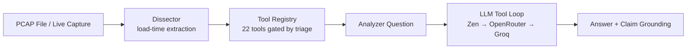

# EasyShark v1.0.0

<p align="center" style="color: #00d4ff; font-weight: bold; line-height: 1.05;">
<pre style="color: #00d4ff; font-weight: bold;">
                    ███████  █████  ███████ ██   ██  █████  ██████  ██   ██
                                                                   v1.0.0


⠀⠀⠀⠀⠀⠀⠀⠀⠀⠀⠀⠀⠀⠀⠀⠀⠀⠀⠀⠀⠀⠀⠀⠀⠀⠀⠀⠀⠀⠀⠀⠀⠀⠀⠀⠀⠀⠀⠀⠀⠀⠀⠀⠲⣶⣶⣤⣤⣀⡀⠀⠀⠀⠀⠀⠀⠀⠀⠀⠀
⠀⠀⠀⠀⠀⠀⠀⠀⠀⠀⠀⠀⠀⠀⠀⠀⠀⠀⠀⠀⠀⠀⠀⠀⠀⠀⠀⠀⠀⠀⠀⠀⠀⠀⠀⠀⠀⠀⠀⠀⠀⠀⠀⠀⠀⠉⠛⠛⢻⣿⣷⣦⣀⠀⠀⠀⠀⠀⠀⠀
⠀⠀⠀⠀⠀⠀⠀⠀⠀⠀⠀⠀⠀⠀⠀⠀⠀⠀⠀⠀⠀⠀⠀⠀⠀⠀⠀⠀⠀⠀⠀⠀⠀⠀⠀⠀⠀⠀⠀⠀⠀⠀⠀⠀⠀⠀⠀⠀⠙⢿⣿⣿⣿⣧⡄⠀⠀⠀⠀⠀
⠀⠀⠀⠀⠀⠀⠀⠀⠀⠀⠀⠀⠀⠀⠀⠀⠀⠀⠀⠀⠀⠀⠀⠀⠀⠀⠀⠀⠀⠀⠀⠀⠀⠀⠀⠀⠀⠀⠀⠀⠀⠀⠀⠀⠀⠀⠀⠀⠀⠀⠈⢻⣿⣿⣿⡆⠀⠀⠀⠀
⠀⠀⠀⠀⠀⠀⠀⠀⠀⠀⠀⠀⠀⠀⠀⠀⠀⠀⠀⠀⠀⠀⠀⠀⠀⠀⠀⠀⠀⠀⠀⠀⠀⠀⠀⠀⠀⠀⠀⠀⠀⠀⠀⠀⠀⠀⠀⠀⠀⠀⠀⠀⢻⣿⣿⣿⡄⠀⠀⠀
⠀⠀⠀⠀⠀⠀⠀⠀⠀⠀⠀⠀⠀⠀⠀⠀⠀⠀⠀⠀⠀⠀⠀⠀⠀⠀⠀⠀⠀⠀⠀⠀⠀⠀⠀⠀⠀⠀⠀⠀⠀⠀⠀⠀⠀⠀⠀⠀⠀⠀⠀⢀⣾⣿⣿⣿⣿⣦⡀⠀
⠀⠀⠀⠀⠀⠀⠀⠀⠀⠀⠀⠀⠀⠀⠀⠀⠀⠀⠀⠀⠀⠀⠀⠀⠀⠀⠀⠀⠀⠀⠀⠀⠀⠀⠀⠀⠀⠀⠀⠀⠀⠀⠀⠀⠀⠀⠀⠀⠀⠀⣴⣿⣿⣿⡿⠿⢿⣿⣷⡀
⠀⠀⠀⠀⠀⠀⠀⠀⠀⠀⠀⠀⠀⠀⠀⠀⠀⠀⠀⠀⠀⠀⠀⠀⠀⠀⠀⠀⠀⠀⠀⠀⣠⣴⣶⡆⠀⠀⠀⠀⠀⠀⠀⠀⠀⠀⠀⠀⢠⣾⡿⠿⠛⠉⠀⠀⠀⣻⣿⡇
⠀⠀⠀⠀⠀⠀⠀⠀⠀⠀⠀⠀⠀⠀⠀⠀⠀⠀⠀⠀⠀⠀⠀⠀⠀⠀⠀⠀⠀⠀⣠⣾⣿⣿⣿⡿⠀⠀⠀⠀⠀⠀⠀⠀⠀⠀⠀⠀⠀⠀⠀⠀⠀⠀⠀⠀⣰⣿⣿⡇
⠀⠀⠀⠀⠀⠀⠀⠀⠀⠀⠀⠀⠀⠀⠀⠀⠀⠀⠀⠀⠀⠀⠀⠀⠀⠀⠀⠀⢀⣾⣿⣿⣿⣿⣿⡇⠀⠀⠀⠀⠀⠀⠀⠀⠀⠀⠀⠀⠀⠀⠀⠀⠀⢀⣠⣾⣿⣿⣿⠇
⠀⠀⠀⠀⠀⠀⠀⠀⠀⠀⠀⠀⠀⠀⠀⠀⠀⠀⠀⠀⠀⠀⠀⠀⠀⠀⠀⣴⣿⣿⣿⣿⣿⣿⣿⡀⠀⠀⠀⠀⠀⠀⠀⠀⠀⠀⠀⠀⢀⣴⣶⣶⣶⣿⣿⣿⣿⣿⠏⠀
⠀⠀⠀⠀⠀⠀⠀⠀⠀⠀⠀⠀⠀⠀⠀⠀⠀⠀⠀⠀⠀⠀⠀⢀⣀⣀⣾⣿⣿⣿⣿⣿⣿⣿⣿⣿⣶⣦⣤⣤⣤⣤⣶⣶⣶⣶⣶⣿⣿⣿⣿⣿⣿⣿⣿⣿⣿⠏⠀⠀
⠀⠀⠀⢀⣀⣀⣀⣀⣀⣤⣤⣴⣶⣶⣶⣶⣶⣿⣿⣿⣿⣿⣿⣿⣿⣿⣿⣿⣿⣿⣿⣿⣿⣿⣿⣿⣿⣿⣿⣿⣿⣿⣿⣿⣿⣿⣿⣿⣿⣿⣿⣿⣿⣿⠿⠛⠋⠀⠀⠀
⠲⣿⣿⣿⣿⣿⣿⣿⣿⣿⣿⣿⣿⣿⣿⣿⣿⣿⣿⣿⣿⣿⣿⣿⣿⣿⣿⣿⣿⣿⣿⣿⣿⣿⣿⣿⣿⣿⣿⣿⣿⣿⣿⣿⣿⣿⣿⣿⣿⣿⣿⣿⠛⠁⠀⠀⠀⠀⠀⠀
⠀⠀⠉⠛⠿⣿⣿⣿⣿⣿⣏⣨⣿⣿⣿⣿⣿⣿⣿⣿⣿⣿⣿⣿⣿⣿⣿⣿⣿⣿⣿⣿⣿⣿⣿⣿⣿⣿⣿⣿⣿⣿⣿⣿⣿⣿⣿⣿⣿⣿⡿⠁⠀⠀⠀⠀⠀⠀⠀⠀
⠀⠀⠀⠀⠀⠈⠋⢉⣉⣿⣿⣿⣿⣿⣿⣿⣿⣿⣿⣿⣿⣿⣿⣿⣿⣿⣿⣿⣿⣿⣿⣿⣿⣿⣿⣿⣿⣿⣿⣿⣿⣿⣿⣿⠿⠛⠛⠉⠉⠉⠁⠀⠀⠀⠀⠀⠀⠀⠀⠀
⠀⠀⠀⠀⠀⠀⠀⠘⠛⠿⠿⠿⢿⣿⣿⣿⣿⣿⣿⣿⣿⣿⣿⣿⣿⣿⣿⣿⣿⣿⣿⣿⣿⣿⣿⣿⣿⣿⠿⠿⠛⠋⠁⠀⠀⠀⠀⠀⠀⠀⠀⠀⠀⠀⠀⠀⠀⠀⠀⠀
⠀⠀⠀⠀⠀⠀⠀⠀⠀⠀⠀⠀⠀⠈⠉⠙⠛⠿⠿⠿⣿⣿⣿⣿⣿⣿⣿⣿⣿⣿⣿⣿⣿⣿⡏⠉⠉⠀⠀⠀⠀⠀⠀⠀⠀⠀⠀⠀⠀⠀⠀⠀⠀⠀⠀⠀⠀⠀⠀⠀
⠀⠀⠀⠀⠀⠀⠀⠀⠀⠀⠀⠀⠀⠀⠀⠀⠀⠀⠀⠀⠀⣿⣿⣿⣿⣿⣿⠟⠻⣿⣿⣿⣿⣿⣿⣄⠀⠀⠀⠀⠀⠀⠀⠀⠀⠀⠀⠀⠀⠀⠀⠀⠀⠀⠀⠀⠀⠀⠀⠀
⠀⠀⠀⠀⠀⠀⠀⠀⠀⠀⠀⠀⠀⠀⠀⠀⠀⠀⠀⠀⠀⢻⣿⣿⣿⣿⠋⠀⠀⠀⠙⠿⣿⣿⣿⣿⣷⣄⠀⠀⠀⠀⠀⠀⠀⠀⠀⠀⠀⠀⠀⠀⠀⠀⠀⠀⠀⠀⠀⠀
⠀⠀⠀⠀⠀⠀⠀⠀⠀⠀⠀⠀⠀⠀⠀⠀⠀⠀⠀⠀⠀⢸⣿⣿⣿⠃⠀⠀⠀⠀⠀⠀⠀⠉⠛⠿⢿⣿⣷⡄⠀⠀⠀⠀⠀⠀⠀⠀⠀⠀⠀⠀⠀⠀⠀⠀⠀⠀⠀⠀
⠀⠀⠀⠀⠀⠀⠀⠀⠀⠀⠀⠀⠀⠀⠀⠀⠀⠀⠀⠀⠀⠈⣿⣿⠏⠀⠀⠀⠀⠀⠀⠀⠀⠀⠀⠀⠀⠀⠀⠀⠀⠀⠀⠀⠀⠀⠀⠀⠀⠀⠀⠀⠀⠀⠀⠀⠀⠀⠀⠀
⠀⠀⠀⠀⠀⠀⠀⠀⠀⠀⠀⠀⠀⠀⠀⠀⠀⠀⠀⠀⠀⠀⠻⠏⠀⠀⠀⠀⠀⠀⠀⠀⠀⠀⠀⠀⠀⠀⠀⠀⠀⠀⠀⠀⠀⠀⠀⠀⠀⠀⠀⠀⠀⠀⠀⠀⠀⠀⠀⠀
</pre>
</p>
<p align="center">
  <a href="https://opensource.org/licenses/MIT"></a>
  <a href=""></a>
  <a href=""></a>
  <a href=""></a>
</p>

**Authors:** Sagnik Ray, Suraj Mishra
---

Wireshark, for decades, has been the best traditional tool for network analysis. It is essential for learning networking fundamentals and conducting serious packet-level forensics. But when the workload gets heavier — triaging multiple captures under time pressure, hunting for specific Indicators of Compromise (IOCs) across thousands of packets, or correlating events across protocols — navigating through Wireshark's filters, streams, and menus can turn into a nightmare.

EasyShark is built for exactly those scenarios. It is a **terminal-native, natural-language-driven PCAP forensic analyst** that lets you ask investigation questions in plain English. EasyShark analyses the capture, calls the right forensic tool for the job, and hands you the answer — with source attribution.

---

## What Makes EasyShark Different

| Traditional Wireshark Workflow | EasyShark Workflow |
|---|---|
| Know which filter to type | Type the question in natural language |
| Manually follow TCP streams | `analyze What SMTP credentials were used?` |
| Cross-reference IPs/domains manually | Tools return structured evidence automatically |
| Build a timeline by inspecting packets | `investigate` generates hypotheses and verifies them |
| No LLM integration | Deterministic dissector + cloud LLM for reasoning |

No GUI. No cloud dependency for core analysis. Just packets and prompts.

---

## Agentic Overview



The shell exposes 8 deterministic info commands (`protocols`, `ips`, `flows`, `files`, `dns`, `creds`, `summary`, `extract`) and 3 AI-powered commands (`analyze`, `investigate` with `--auto`, `rule`). The LLM tool loop uses a 3-provider fallback chain — Zen (primary) → OpenRouter (secondary) → Groq (last resort) — all via free-tier models. No local model is required.

---

## Quick Start

```bash
# Install dependencies
pip install -r requirements.txt

# Set up API keys (copy and edit)
cp .env.example .env
# Edit .env with your Zen API key (or OpenRouter/Groq as fallback)

# Analyse a PCAP
python3 main.py PCAP_SAMPLES/evidence01.pcap
```

### Sample PCAPs

The repository ships with labelled and unlabelled captures in `PCAP_SAMPLES/`:

| File | Description | Size |
|---|---|---|
| `evidence01.pcap` | AIM file transfer (240 packets) | Labelled |
| `evidence02.pcap` | SMTP email with docx attachment (572 packets) | Labelled |
| `evidence03.pcap` | HTTP / AppleTV traffic (1778 packets) | Unlabelled |
| `evidence04.pcap` | Mixed traffic (short) | Unlabelled |
| `infected.pcap` | Unknown — potentially malicious | Unlabelled |

Try these questions on evidence01:

```
pcap > analyze What is the MD5 of the file transferred over AIM?
pcap > analyze How many TCP packets were sent to port 443 by 192.168.1.158?
pcap > investigate What happened in this capture? --auto
```

---

## Commands

```
┌─ Commands ──────────────────────────────────────────────────┐
│ analyze <question>   Ask a forensic question (LLM-powered)  │
│ investigate <q>      Multi-hypothesis investigation         │
│ protocols            Protocol breakdown table               │
│ ips                  Host summary table                     │
│ flows                Top flows table                        │
│ files                Extracted files list                   │
│ dns                  DNS queries and anomalies              │
│ creds                Extracted credentials                  │
│ summary              Capture overview (0 LLM calls)         │
│ extract <filename>   Save extracted file to disk            │
│ capture interfaces   List capture interfaces                │
│ capture start <if>   Start live capture                     │
│ capture stop         Stop and reload capture                │
│ sessions             List saved sessions                    │
│ session info         Current session details                │
│ session forget       Delete current session                 │
│ exit / quit          Exit EasyShark                         │
└──────────────────────────────────────────────────────────────┘
```

---

## Requirements

- Python 3.10+
- WSL2 / Linux (recommended) or macOS
- 7.4 GB RAM minimum (for PCAP processing + browser overhead)
- Network access for LLM queries (Zen API key required; offline deterministic info commands work without network)
- No GPU required

---

## Project Status

⚠ **Early developmental stage.** EasyShark is functional and passes regression on labelled PCAPs (198 tests, all passing), but you may encounter:

- **Hallucinated answers** — the LLM can sometimes invent evidence. The claim-grounding pass and hallucination detector flag these, but they are not foolproof.
- **Tool-loop failures** — free-tier models can timeout or return malformed responses. The tool loop retries once then falls back to a dissection-aware summary.
- **Unlabelled PCAPs** — heuristic coverage on novel captures is unmeasured. Questions outside the ~14 supported intent families may yield "Insufficient data".

---

## Contributing

This project is **open to contributions**. All TUI code lives in `main.py` and `cli/shell.py`. The forensic tools, detectors, dissector, and memory systems are in `ai/`, `core/`, and `cli/`. No third-party TUI libraries (no curses, no rich) — only ANSI escape codes.

Key areas for contribution:

- **New forensic tools** — add tools to `ai/tool_registry.py`
- **Dissector extractors** — add protocol parsers to `core/dissector.py`
- **Pattern learner** — improve learned tool hint accuracy in `ai/pattern_learner.py`
- **Prompt optimisation** — sharpen system prompts in `ai/prompt_optimizer.py`
- **Test coverage** — add regression tests for new PCAPs

---

## License

MIT — see [LICENSE](LICENSE). Free to use, modify, and distribute.
