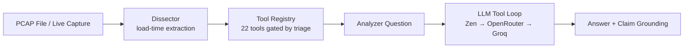

# EasyShark v2.0.0 (Autonomous Edition)

<p align="center" style="color: #00d4ff; font-weight: bold; line-height: 1.05;">
<pre style="color: #00d4ff; font-weight: bold;">
                    ███████  █████  ███████ ██   ██  █████  ██████  ██   ██
                                                                   v2.0.0


⠀⠀⠀⠀⠀⠀⠀⠀⠀⠀⠀⠀⠀⠀⠀⠀⠀⠀⠀⠀⠀⠀⠀⠀⠀⠀⠀⠀⠀⠀⠀⠀⠀⠀⠀⠀⠀⠀⠀⠀⠀⠀⠀⠲⣶⣶⣤⣤⣀⡀⠀⠀⠀⠀⠀⠀⠀⠀⠀⠀
⠀⠀⠀⠀⠀⠀⠀⠀⠀⠀⠀⠀⠀⠀⠀⠀⠀⠀⠀⠀⠀⠀⠀⠀⠀⠀⠀⠀⠀⠀⠀⠀⠀⠀⠀⠀⠀⠀⠀⠀⠀⠀⠀⠀⠀⠉⠛⠛⢻⣿⣷⣦⣀⠀⠀⠀⠀⠀⠀⠀
⠀⠀⠀⠀⠀⠀⠀⠀⠀⠀⠀⠀⠀⠀⠀⠀⠀⠀⠀⠀⠀⠀⠀⠀⠀⠀⠀⠀⠀⠀⠀⠀⠀⠀⠀⠀⠀⠀⠀⠀⠀⠀⠀⠀⠀⠀⠀⠀⠙⢿⣿⣿⣿⣧⡄⠀⠀⠀⠀⠀
⠀⠀⠀⠀⠀⠀⠀⠀⠀⠀⠀⠀⠀⠀⠀⠀⠀⠀⠀⠀⠀⠀⠀⠀⠀⠀⠀⠀⠀⠀⠀⠀⠀⠀⠀⠀⠀⠀⠀⠀⠀⠀⠀⠀⠀⠀⠀⠀⠀⠀⠈⢻⣿⣿⣿⡆⠀⠀⠀⠀
⠀⠀⠀⠀⠀⠀⠀⠀⠀⠀⠀⠀⠀⠀⠀⠀⠀⠀⠀⠀⠀⠀⠀⠀⠀⠀⠀⠀⠀⠀⠀⠀⠀⠀⠀⠀⠀⠀⠀⠀⠀⠀⠀⠀⠀⠀⠀⠀⠀⠀⠀⠀⢻⣿⣿⣿⡄⠀⠀⠀
⠀⠀⠀⠀⠀⠀⠀⠀⠀⠀⠀⠀⠀⠀⠀⠀⠀⠀⠀⠀⠀⠀⠀⠀⠀⠀⠀⠀⠀⠀⠀⠀⠀⠀⠀⠀⠀⠀⠀⠀⠀⠀⠀⠀⠀⠀⠀⠀⠀⠀⠀⢀⣾⣿⣿⣿⣿⣦⡀⠀
⠀⠀⠀⠀⠀⠀⠀⠀⠀⠀⠀⠀⠀⠀⠀⠀⠀⠀⠀⠀⠀⠀⠀⠀⠀⠀⠀⠀⠀⠀⠀⠀⠀⠀⠀⠀⠀⠀⠀⠀⠀⠀⠀⠀⠀⠀⠀⠀⠀⠀⣴⣿⣿⣿⡿⠿⢿⣿⣷⡀
⠀⠀⠀⠀⠀⠀⠀⠀⠀⠀⠀⠀⠀⠀⠀⠀⠀⠀⠀⠀⠀⠀⠀⠀⠀⠀⠀⠀⠀⠀⠀⠀⣠⣴⣶⡆⠀⠀⠀⠀⠀⠀⠀⠀⠀⠀⠀⠀⢠⣾⡿⠿⠛⠉⠀⠀⠀⣻⣿⡇
⠀⠀⠀⠀⠀⠀⠀⠀⠀⠀⠀⠀⠀⠀⠀⠀⠀⠀⠀⠀⠀⠀⠀⠀⠀⠀⠀⠀⠀⠀⣠⣾⣿⣿⣿⡿⠀⠀⠀⠀⠀⠀⠀⠀⠀⠀⠀⠀⠀⠀⠀⠀⠀⠀⠀⠀⣰⣿⣿⡇
⠀⠀⠀⠀⠀⠀⠀⠀⠀⠀⠀⠀⠀⠀⠀⠀⠀⠀⠀⠀⠀⠀⠀⠀⠀⠀⠀⠀⢀⣾⣿⣿⣿⣿⣿⡇⠀⠀⠀⠀⠀⠀⠀⠀⠀⠀⠀⠀⠀⠀⠀⠀⠀⢀⣠⣾⣿⣿⣿⠇
⠀⠀⠀⠀⠀⠀⠀⠀⠀⠀⠀⠀⠀⠀⠀⠀⠀⠀⠀⠀⠀⠀⠀⠀⠀⠀⠀⣴⣿⣿⣿⣿⣿⣿⣿⡀⠀⠀⠀⠀⠀⠀⠀⠀⠀⠀⠀⠀⢀⣴⣶⣶⣶⣿⣿⣿⣿⣿⠏⠀
⠀⠀⠀⠀⠀⠀⠀⠀⠀⠀⠀⠀⠀⠀⠀⠀⠀⠀⠀⠀⠀⠀⠀⢀⣀⣀⣾⣿⣿⣿⣿⣿⣿⣿⣿⣿⣶⣦⣤⣤⣤⣤⣶⣶⣶⣶⣶⣿⣿⣿⣿⣿⣿⣿⣿⣿⣿⠏⠀⠀
⠀⠀⠀⢀⣀⣀⣀⣀⣀⣤⣤⣴⣶⣶⣶⣶⣶⣿⣿⣿⣿⣿⣿⣿⣿⣿⣿⣿⣿⣿⣿⣿⣿⣿⣿⣿⣿⣿⣿⣿⣿⣿⣿⣿⣿⣿⣿⣿⣿⣿⣿⣿⣿⣿⠿⠛⠋⠀⠀⠀
⠲⣿⣿⣿⣿⣿⣿⣿⣿⣿⣿⣿⣿⣿⣿⣿⣿⣿⣿⣿⣿⣿⣿⣿⣿⣿⣿⣿⣿⣿⣿⣿⣿⣿⣿⣿⣿⣿⣿⣿⣿⣿⣿⣿⣿⣿⣿⣿⣿⣿⣿⣿⠛⠁⠀⠀⠀⠀⠀⠀
⠀⠀⠉⠛⠿⣿⣿⣿⣿⣿⣏⣨⣿⣿⣿⣿⣿⣿⣿⣿⣿⣿⣿⣿⣿⣿⣿⣿⣿⣿⣿⣿⣿⣿⣿⣿⣿⣿⣿⣿⣿⣿⣿⣿⣿⣿⣿⣿⣿⣿⡿⠁⠀⠀⠀⠀⠀⠀⠀⠀
⠀⠀⠀⠀⠀⠈⠋⢉⣉⣿⣿⣿⣿⣿⣿⣿⣿⣿⣿⣿⣿⣿⣿⣿⣿⣿⣿⣿⣿⣿⣿⣿⣿⣿⣿⣿⣿⣿⣿⣿⣿⣿⣿⣿⠿⠛⠛⠉⠉⠉⠁⠀⠀⠀⠀⠀⠀⠀⠀⠀
⠀⠀⠀⠀⠀⠀⠀⠘⠛⠿⠿⠿⢿⣿⣿⣿⣿⣿⣿⣿⣿⣿⣿⣿⣿⣿⣿⣿⣿⣿⣿⣿⣿⣿⣿⣿⣿⣿⠿⠿⠛⠋⠁⠀⠀⠀⠀⠀⠀⠀⠀⠀⠀⠀⠀⠀⠀⠀⠀⠀
⠀⠀⠀⠀⠀⠀⠀⠀⠀⠀⠀⠀⠀⠈⠉⠙⠛⠿⠿⠿⣿⣿⣿⣿⣿⣿⣿⣿⣿⣿⣿⣿⣿⣿⡏⠉⠉⠀⠀⠀⠀⠀⠀⠀⠀⠀⠀⠀⠀⠀⠀⠀⠀⠀⠀⠀⠀⠀⠀⠀
⠀⠀⠀⠀⠀⠀⠀⠀⠀⠀⠀⠀⠀⠀⠀⠀⠀⠀⠀⠀⠀⣿⣿⣿⣿⣿⣿⠟⠻⣿⣿⣿⣿⣿⣿⣄⠀⠀⠀⠀⠀⠀⠀⠀⠀⠀⠀⠀⠀⠀⠀⠀⠀⠀⠀⠀⠀⠀⠀⠀
⠀⠀⠀⠀⠀⠀⠀⠀⠀⠀⠀⠀⠀⠀⠀⠀⠀⠀⠀⠀⠀⢻⣿⣿⣿⣿⠋⠀⠀⠀⠙⠿⣿⣿⣿⣿⣷⣄⠀⠀⠀⠀⠀⠀⠀⠀⠀⠀⠀⠀⠀⠀⠀⠀⠀⠀⠀⠀⠀⠀
⠀⠀⠀⠀⠀⠀⠀⠀⠀⠀⠀⠀⠀⠀⠀⠀⠀⠀⠀⠀⠀⢸⣿⣿⣿⠃⠀⠀⠀⠀⠀⠀⠀⠉⠛⠿⢿⣿⣷⡄⠀⠀⠀⠀⠀⠀⠀⠀⠀⠀⠀⠀⠀⠀⠀⠀⠀⠀⠀⠀
⠀⠀⠀⠀⠀⠀⠀⠀⠀⠀⠀⠀⠀⠀⠀⠀⠀⠀⠀⠀⠀⠈⣿⣿⠏⠀⠀⠀⠀⠀⠀⠀⠀⠀⠀⠀⠀⠀⠀⠀⠀⠀⠀⠀⠀⠀⠀⠀⠀⠀⠀⠀⠀⠀⠀⠀⠀⠀⠀⠀
⠀⠀⠀⠀⠀⠀⠀⠀⠀⠀⠀⠀⠀⠀⠀⠀⠀⠀⠀⠀⠀⠀⠻⠏⠀⠀⠀⠀⠀⠀⠀⠀⠀⠀⠀⠀⠀⠀⠀⠀⠀⠀⠀⠀⠀⠀⠀⠀⠀⠀⠀⠀⠀⠀⠀⠀⠀⠀⠀⠀
</pre>
</p>
<p align="center">
  <a href="https://opensource.org/licenses/MIT"></a>
  <a href=""></a>
  <a href=""></a>
  <a href=""></a>
</p>

**Authors:** Sagnik Ray, Suraj Mishra, Md Sahil Molla
---

Wireshark, for decades, has been the best traditional tool for network analysis. It is essential for learning networking fundamentals and conducting serious packet-level forensics. But when the workload gets heavier — triaging multiple captures under time pressure, hunting for specific Indicators of Compromise (IOCs) across thousands of packets, or correlating events across protocols — navigating through Wireshark's filters, streams, and menus can turn into a nightmare.

EasyShark is built for exactly those scenarios. It is a **terminal-native, natural-language-driven PCAP forensic analyst** that lets you ask investigation questions in plain English. EasyShark analyses the capture, calls the right forensic tool for the job, and hands you the answer — with source attribution.

---

## What Makes EasyShark Different

| Traditional Wireshark Workflow | EasyShark Workflow |
|---|---|
| Know which filter to type | Type the question in natural language |
| Manually follow TCP streams | `analyze What SMTP credentials were used?` |
| Cross-reference IPs/domains manually | Tools return structured evidence automatically |
| Build a timeline by inspecting packets | `investigate` generates hypotheses and verifies them |
| No LLM integration | Deterministic dissector + cloud LLM for reasoning |

No GUI. No cloud dependency for core analysis. Just packets and prompts.

---

## Agentic Overview



The shell exposes 8 deterministic info commands (`protocols`, `ips`, `flows`, `files`, `dns`, `creds`, `summary`, `extract`) and 3 AI-powered commands (`analyze`, `investigate` with `--auto`, `rule`). The LLM tool loop uses a 3-provider fallback chain — Zen (primary) → OpenRouter (secondary) → Groq (last resort) — all via free-tier models. No local model is required.

---

## Quick Start

```bash
# Install dependencies
pip install -r requirements.txt

# Set up API keys (copy and edit)
cp .env.example .env
# Edit .env with your Zen API key (or OpenRouter/Groq as fallback)

# Analyse a PCAP
python3 main.py PCAP_SAMPLES/evidence01.pcap
```

### Sample PCAPs

The repository ships with labelled and unlabelled captures in `PCAP_SAMPLES/`:

| File | Description | Size |
|---|---|---|
| `evidence01.pcap` | AIM file transfer (240 packets) | Labelled |
| `evidence02.pcap` | SMTP email with docx attachment (572 packets) | Labelled |
| `evidence03.pcap` | HTTP / AppleTV traffic (1778 packets) | Unlabelled |
| `evidence04.pcap` | Mixed traffic (short) | Unlabelled |
| `infected.pcap` | Unknown — potentially malicious | Unlabelled |

Try these questions on evidence01:

```
pcap > analyze What is the MD5 of the file transferred over AIM?
pcap > analyze How many TCP packets were sent to port 443 by 192.168.1.158?
pcap > investigate What happened in this capture? --auto
```

### Autonomous headless investigation

Run the planner, executor, critic, and report synthesis without entering the
interactive shell. The JSON report is saved under `~/.easyshark/reports/`:

```bash
python3 main.py PCAP_SAMPLES/evidence01.pcap --autonomous \
  --mission "Investigate suspicious activity and possible data exfiltration" \
  --threat-feed ./intel.json
```

RSI patterns start as candidates and are not reused until independently
validated. After reviewing a result, label a matching pattern from the shell:

```text
pcap > memory rsi label good What SMTP username was used?
pcap > memory rsi status
```

Patterns require three independent labels and a 75% positive rate before
promotion. Repeated negative labels retire them automatically. Set
`EASYSHARK_RSI_REQUIRE_FEEDBACK=0` only to restore legacy heuristic-only
behavior.

## Monitoring and deployment

`core.monitor.PCAPMonitor` watches a directory for new PCAPs and can invoke
the autonomous mission callback once per capture. `WebhookAlerter` provides a
dependency-free HTTP alert integration, while `core.audit` records local
operations and `core.observability` exposes counters.

Generated analysis tools can use a separate interpreter by setting
`EASYSHARK_PROCESS_SANDBOX=1`. Build the included non-root container with:

```bash
docker build -t easyshark .
# Persistent state and monitor health port:
docker run --rm -v "$PWD/captures:/captures" -v easyshark-data:/data \
  -p 127.0.0.1:8765:8765 easyshark \
  --monitor /captures --health-port 8765 --once
```

For a continuously running deployment, copy `.env.example`, set a strong
`EASYSHARK_HEALTH_TOKEN`, and run `docker compose up --build`.

Run the durable autonomous monitor:

```bash
python3 main.py --monitor ./captures --interval 30 \
  --mission "Investigate suspicious activity and possible exfiltration" \
  --webhook https://example.invalid/security-events
```

Jobs are persisted in `~/.easyshark/jobs.db`, retried up to three times, and
reports are written to `~/.easyshark/reports/`.

For local monitoring health checks, add `--health-port 8765` and query
`http://127.0.0.1:8765/health` or `/metrics`.
Set `EASYSHARK_HEALTH_TOKEN` to require the `X-EasyShark-Token` header.
Use `--event-log ~/.easyshark/events.jsonl` for a versioned SIEM-ingestion
stream. Use `--event-webhook https://siem.example/events` to send the same
versioned envelopes to a SIEM/SOAR endpoint; failed deliveries are persisted
in a separate outbox and retried after restart.
Use `--threat-feed ./intel.json` (or `EASYSHARK_THREAT_FEED`) to attach local
IOC verdicts to autonomous reports. Remote feeds must be loaded by a trusted
HTTPS-capable integration; the core feed loader rejects non-HTTPS URLs.

For autonomous SOC triage, add `--mode soc-analyst`. This adds case priority,
disposition, evidence coverage, affected-host scope, IOC context, and an
approval-gated response plan to the saved report:

```bash
python3 main.py capture.pcap --autonomous --mode soc-analyst \
  --mission "Triage, scope, and document suspicious activity"
```

Inside the shell, use `soc-analyst [mission]`. Feed and operational dashboard
capabilities are terminal-native through `update-feeds`, `ioc-check`, `events`,
`reports`, and `evidence`.

### CYSOC Terminal

For the complete SOC analyst and CYSOC operational guide, see
[`README-CYSOC.md`](README-CYSOC.md).

Open the dedicated SOC workspace from an active capture:

```text
pcap > soc-analyst terminal

CYSOC TERMINAL  |  SOC investigation workspace
cysoc > overview
cysoc > triage Investigate possible command-and-control traffic
cysoc > case
cysoc > evidence 0
cysoc > back
pcap >
```

`cysoc-terminal` is a direct alias. The nested terminal reuses every EasyShark
forensic command and the same safety and approval policies. `exit`, `back`, or
`quit` returns to the normal shell; it does not terminate EasyShark.

CYSOC also maintains a vendor-neutral SQLite operations store at
`~/.easyshark/cysoc.db` (override with `EASYSHARK_SOC_DB`). Import JSON or
JSONL exports from a SIEM, EDR, identity provider, firewall, DNS platform, or
other telemetry source:

```text
cysoc > ingest sentinel-alerts.jsonl sentinel
cysoc > pulse
cysoc > queue p1,p2
cysoc > case create P1 Investigate FIN-LAPTOP-22
cysoc > case link CYSOC-20260812-AB12 sentinel:alert-1842
cysoc > case assign CYSOC-20260812-AB12 sahil
cysoc > correlate FIN-LAPTOP-22
cysoc > hunt bad.example
cysoc > detections
cysoc > action request CYSOC-20260812-AB12 Isolate FIN-LAPTOP-22
cysoc > action approve 1 soc-lead
cysoc > benchmark generate .easyshark/synthetic-corpus
cysoc > benchmark corpus .easyshark/synthetic-corpus/manifest.json
cysoc > oracle
cysoc > oracle rederive .easyshark/reports/case.json
cysoc > baseline check FIN-LAPTOP-22 bytes_out 5000000
cysoc > similar CYSOC-20260812-AB12
cysoc > campaign build CYSOC-20260812-AB12
cysoc > response local CYSOC-20260812-AB12 watchlist bad.example 3600
```

The generated PCAP corpus is deterministic and hash-pinned, with a benign control and
labelled detector/safety cases. It is for regression testing and does not replace the
independently labelled production-validation corpus.

Approval records never execute external changes by themselves. Execution stays
disabled until a separately authenticated response connector is configured.
Autonomous `soc-analyst` reports are automatically registered as durable cases,
including priority, disposition, evidence graph, review status, and response
recommendations. Oracle outcomes are stored separately in `~/.easyshark/oracle.db`.
Corpus runs report precision, recall, Brier score, and expected calibration error;
the repository does not claim production targets until a representative labelled
corpus has actually been run. Packet bytes remain local during all oracle runs.

`response local` is limited to expiring tags, watchlists, and snapshots. Isolation,
blocking, account changes, notifications, and other external actions remain approval
gated and require a separately authenticated connector. Packet/tool content is
serialized as untrusted observation data; instruction-like payloads are reported as
findings and are blocked from the response path.

Generated Python analysis runs in the local isolated process by default.
To use OpenSandbox, install `requirements-opensandbox.txt`, configure
`OPEN_SANDBOX_DOMAIN`, `OPEN_SANDBOX_PROTOCOL`, and `OPEN_SANDBOX_API_KEY`, then
set `EASYSHARK_SANDBOX_BACKEND=opensandbox`. `auto` uses OpenSandbox when it is
configured and otherwise safely falls back to the local process sandbox. The
remote sandbox is resource-limited, has deny-by-default egress, and is destroyed
after each execution.

The monitor requires HTTPS webhooks by default. Set
`EASYSHARK_ALLOW_HTTP_WEBHOOK=1` only for a trusted local test endpoint.

GitHub Actions runs the Python test suite and builds the Docker image on every
push and pull request.

Legacy labelled tool-routing cases can be scored with `ai.benchmark.score`. Automatic
RSI promotion and prompt distillation consume only independent outcomes from the
corpus, synthetic, re-derivation, delayed-intel, or cross-path oracles. The critic is
an in-run quality gate and is never a cross-run fitness signal.

---

## Commands

### Terminal operations and export extensions

V2 is terminal-native. Use `sessions`, `events`, `reports`, and `evidence` for
session drill-down, live/durable activity, saved investigations, and evidence
graphs. The Vite dashboard is maintained separately in the sibling V3 tree and
is not duplicated in V2.

The report command also supports deterministic offline exports:
`report --mitre`, `report --sigma`, and `report --spl`. TLS ClientHello
fingerprints are available through `core.tls_fingerprint`, and
`core.anonymizer.Anonymizer` creates safe packet metadata for external model
calls without changing the original capture.

```
┌─ Commands ──────────────────────────────────────────────────┐
│ analyze <question>   Ask a forensic question (LLM-powered)  │
│ investigate <q>      Multi-hypothesis investigation         │
│ protocols            Protocol breakdown table               │
│ ips                  Host summary table                     │
│ flows                Top flows table                        │
│ files                Extracted files list                   │
│ dns                  DNS queries and anomalies              │
│ creds                Extracted credentials                  │
│ summary              Capture overview (0 LLM calls)         │
│ extract <filename>   Save extracted file to disk            │
│ capture interfaces   List capture interfaces                │
│ capture start <if>   Start live capture                     │
│ capture stop         Stop and reload capture                │
│ sessions             List saved sessions                    │
│ session info         Current session details                │
│ session forget       Delete current session                 │
│ exit / quit          Exit EasyShark                         │
└──────────────────────────────────────────────────────────────┘
```

---

## Requirements

- Python 3.10+
- WSL2 / Linux (recommended) or macOS
- 7.4 GB RAM minimum (for PCAP processing + browser overhead)
- Network access for LLM queries (Zen API key required; offline deterministic info commands work without network)
- No GPU required

---

## Project Status

⚠ **Early developmental stage.** EasyShark is functional and currently passes 115 automated tests, but you may encounter:

- **Hallucinated answers** — the LLM can sometimes invent evidence. The claim-grounding pass and hallucination detector flag these, but they are not foolproof.
- **Tool-loop failures** — free-tier models can timeout or return malformed responses. The tool loop retries once then falls back to a dissection-aware summary.
- **Late Response** - Free models do give a late response, making the tool slower.

---

## Contributing

This project is **open to contributions**. All TUI code lives in `main.py` and `cli/shell.py`. The forensic tools, detectors, dissector, and memory systems are in `ai/`, `core/`, and `cli/`. No third-party TUI libraries (no curses, no rich) — only ANSI escape codes.

Key areas for contribution:

- **New forensic tools** — add tools to `ai/tool_registry.py`
- **Dissector extractors** — add protocol parsers to `core/dissector.py`
- **Pattern learner** — improve learned tool hint accuracy in `ai/pattern_learner.py`
- **Prompt optimisation** — sharpen system prompts in `ai/prompt_optimizer.py`
- **Test coverage** — add regression tests for new PCAPs

---

## License

MIT — see [LICENSE](LICENSE). Free to use, modify, and distribute.
